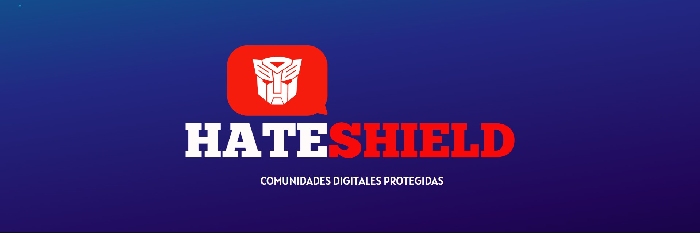

# HATE SHIELD

[Mira nuestra presentación de negocio](https://mariarosacuenca.my.canva.site/models)

Usuario

+  Escribe un texto o una url para ser analizados y selecciona un modelo.

Frontend (Streamlit)

+  Proporciona la interfaz gráfica.
+  Envia datos al backend mediante solicitudes HTTP.
+  Recibe y muestra los resultados devueltos.

Backend (FastAPI + Uvicorn)

+  Recibe los datos desde el frontend y los pasa por un pipeline.
+  Llama al modelo Tradicional o Transformer para generar predicciones.
+  Devuelve los resultados al frontend.

Pipeline (Preprocesamiento, Traducción y Tokenización)

+  Preprocesamiento: Limpieza y normalización del texto.
+  Traducción: Utiliza Googletrans para traducir el texto al idioma que el modelo maneja (si aplica).
+  Tokenización: Convierte el texto en tokens que pueden ser procesados por el modelo.

El modelo clasifica el texto en clases (odio vs. odio).

Los datos y resultados se almacenan en PostgreSQL.

## Getting Started

Simplemente ejecuta el archivo run.py y la magia se hará sola.

Ah! La base de datos Postgres (hateshield) debes tenerla en local ;)

Y no olvides configurar tu .env:

  YOUTUBE_API_KEY= ?
  
  MODEL_PATH=model/ensemble_model_complete.joblib
  
  API_URL = http://127.0.0.1:8000/predict
  
  INFO_URL = http://127.0.0.1:8000/info
  
  DB_NAME=hateshield
  
  DB_USER=postgres
  
  DB_PASSWORD= ?
  
  DB_HOST=localhost
  
  DB_PORT=5432
